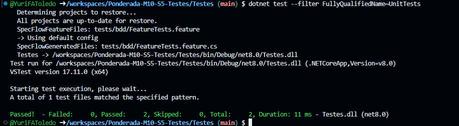
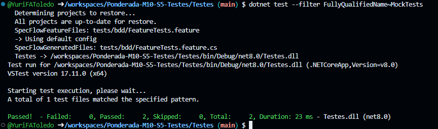
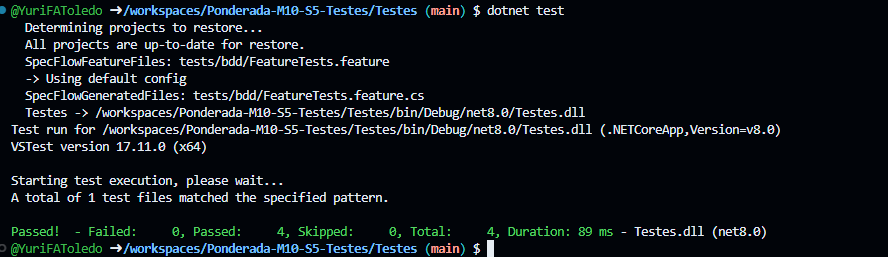

# Aplicando Testes

Este repositório contém a implementação de testes de software aplicando as técnicas de **Testes de Unidade**, **Testes com Mocks** e **Testes BDD**. Cada teste está documentado com uma explicação clara e exemplos práticos.


## Testes de Unidade

### O que são Testes de Unidade?
Testes de Unidade verificam se partes individuais (unidades) do código estão funcionando conforme esperado. Eles se concentram em testar partes isoladas, como métodos e funções.

### Exemplos de Testes de Unidade
**Exemplo 1: Verificação de uma operação de soma**
```csharp
[Fact]
public void Teste_Soma_Deve_Retornar_Resultado_Correto()
{
    int resultado = 2 + 3;
    Assert.Equal(5, resultado);
}
```

**Exemplo 2: Verificação de uma operação de subtração**
```csharp
[Fact]
public void Teste_Subtracao_Deve_Retornar_Resultado_Correto()
{
    int resultado = 5 - 3;
    Assert.Equal(2, resultado);
}

```



## Testes com Mock

### O que são Testes com Mock?
Os Mocks permitem simular o comportamento de objetos e dependências externas de forma controlada. Isso permite testar classes e métodos que dependem de serviços externos.

### Exemplos de Testes com Mock
**Exemplo 1: Multiplicação simulada com Moq**
```csharp
[Fact]
public void Teste_Mock_Multiplicacao_Deve_Retornar_Valor_Especifico()
{
    var mock = new Moq.Mock<IServico>();
    mock.Setup(x => x.Multiplicar(2, 3)).Returns(6);

    int resultado = mock.Object.Multiplicar(2, 3);
    Assert.Equal(6, resultado);
}
```

**Exemplo 2: Verificação de chamada de método**
```csharp
[Fact]
public void Teste_Mock_Multiplicacao_Nao_Chamada()
{
    var mock = new Moq.Mock<IServico>();
    mock.Verify(x => x.Multiplicar(It.IsAny<int>(), It.IsAny<int>()), Times.Never);
}

```



## Testes BDD

### O que são Testes BDD?
Os Testes de Desenvolvimento Orientado por Comportamento (BDD) garantem que as funcionalidades do software estão funcionando como esperado. Eles se baseiam em cenários reais descritos em linguagem natural.

### Exemplo de Teste BDD
**Arquivo de Cenário: FeatureTests.feature**
```gherkin
Feature: Calculadora

Cenário: Soma de dois números
  Dado que eu tenho o número 2
  E eu tenho o número 3
  Quando eu somo os dois números
  Então o resultado deve ser 5
```

**Arquivo de Passos: FeatureTestsSteps.cs**
```csharp
[Given(@"que eu tenho o número (.*)")]
public void DadoQueEuTenhoONumero(int numero)
{
    if (_numero1 == 0)
        _numero1 = numero;
    else
        _numero2 = numero;
}

[When(@"eu somo os dois números")]
public void QuandoEuSomoOsDoisNumeros()
{
    _resultado = _numero1 + _numero2;
}

[Then(@"o resultado deve ser (.*)")]
public void EntaoOResultadoDeveSer(int resultadoEsperado)
{
    Assert.Equal(resultadoEsperado, _resultado);
}

```

